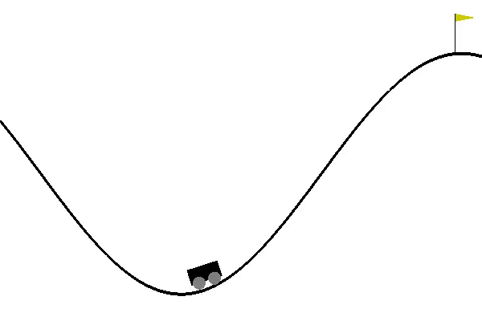
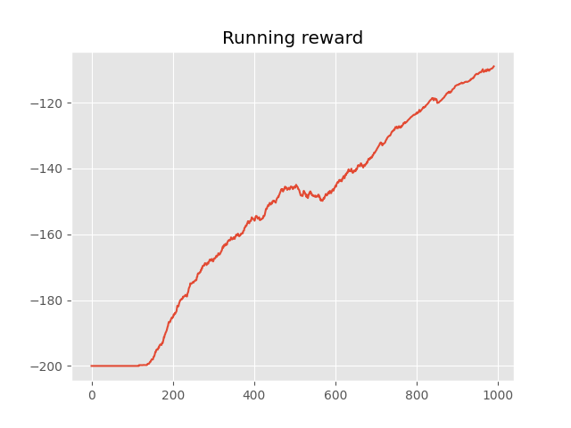

# MountainCar: DDQN+RND
> Implementation of Double Deep Q-Networks with extra bonus produced by random network distillation on the MountainCar environment (discrete version).  

The MountainCar is known to be difficult and impossible problem to be solved by conventional RL algorithms that suffers from state-independent (like epsilon-greedy) or unintelligent (like Adding noise to the action selected or adding Entropy-regularized penalty to cost function) exploration strategies. Random Network Distillation offers a solution to make the exploration phase adaptive to the agent's needs. It relates the curiosity and novelty to the output of two functions (modeled as neural networks). The target function maps a state to a vector of numbers and the predictor function tries to guess this vector. If the predictor fails to predict well then it means the agent has not experienced that state too many times so it should be encouraged to visit it more until the predictor is able to predict the output of the target function for that state. This trick forces the agent to explore where ever it recognize as novel. The encouragement is modeled by an extra reward named **Intrinsic reward**.
By having Intrinsic reward the MountainCar environment turns to be a **Dense reward** and now it can be easily solved by Double Deep Q-Networks.
- **Usage of Double Q-Learning instead of Q-Learning boosted the performance significantly**.  
- In this implementation the target network maps each state to 64 number vector. **You may change it and observe the result**. 


## Dependencies
- gym == 0.17.2
- matplotlib == 3.1.2
- numpy == 1.19.1
- torch == 1.4.0

## Installation
```shell
pip3 install -r requirements.txt
```

## Demo
<p align="center">
  
</p>  

## Result
<p align="center">
  
</p>

## Reference
1. [_Human-level control through deep reinforcement learning_, Mnih et al., 2015](https://www.nature.com/articles/nature14236)  
2. [_Deep Reinforcement Learning with Double Q-learning_, Van Hasselt et al., 2015](https://arxiv.org/abs/1509.06461)  
3. [_Exploration by Random Network Distillation_, Burda et al., 2018](https://arxiv.org/abs/1810.12894)  

## Acknowledgement
- [@MorvanZhou](https://github.com/MorvanZhou) for [Curiosity model](https://github.com/MorvanZhou/Reinforcement-learning-with-tensorflow/tree/master/contents/Curiosity_Model).  
- [@orrivlin](https://github.com/orrivlin) for [DQN_RND](https://github.com/orrivlin/MountainCar_DQN_RND).  
